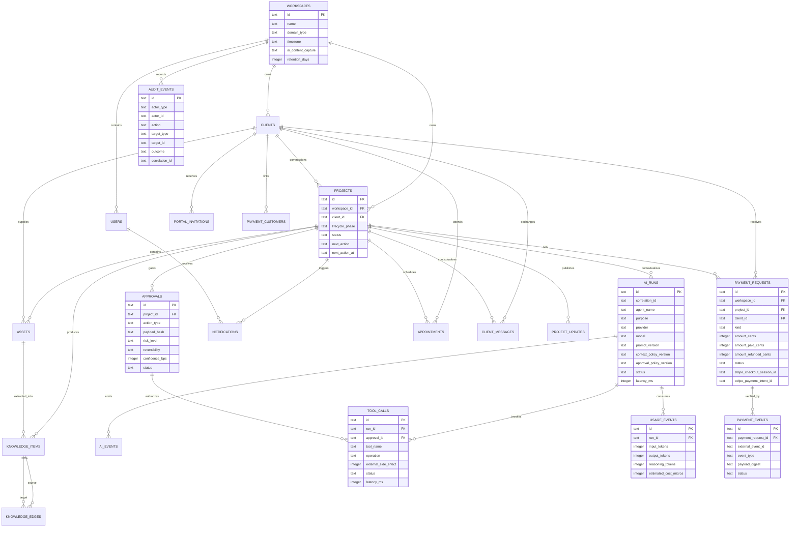

# Legacy OS Entity Relationship Diagram

This diagram represents the implemented foundation schema. Additional tattoo-session, healing, and content-publication tables should be introduced as their workflow specifications enter implementation.

